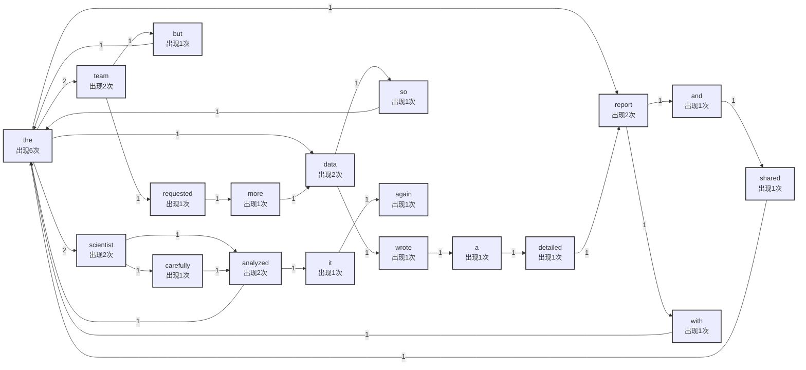

# 有向图结构

```mermaid
graph LR
  %% 定义节点样式
  classDef default fill:#lightblue,stroke:#333,stroke-width:2px;

  the["the<br/>出现6次"]
  scientist["scientist<br/>出现2次"]
  carefully["carefully<br/>出现1次"]
  analyzed["analyzed<br/>出现2次"]
  data["data<br/>出现2次"]
  wrote["wrote<br/>出现1次"]
  a["a<br/>出现1次"]
  detailed["detailed<br/>出现1次"]
  report["report<br/>出现2次"]
  and["and<br/>出现1次"]
  shared["shared<br/>出现1次"]
  with["with<br/>出现1次"]
  team["team<br/>出现2次"]
  but["but<br/>出现1次"]
  requested["requested<br/>出现1次"]
  more["more<br/>出现1次"]
  so["so<br/>出现1次"]
  it["it<br/>出现1次"]
  again["again<br/>出现1次"]

  the -->|1| data
  the -->|2| scientist
  the -->|1| report
  the -->|2| team
  scientist -->|1| carefully
  scientist -->|1| analyzed
  carefully -->|1| analyzed
  analyzed -->|1| the
  analyzed -->|1| it
  data -->|1| wrote
  data -->|1| so
  wrote -->|1| a
  a -->|1| detailed
  detailed -->|1| report
  report -->|1| with
  report -->|1| and
  and -->|1| shared
  shared -->|1| the
  with -->|1| the
  team -->|1| but
  team -->|1| requested
  but -->|1| the
  requested -->|1| more
  more -->|1| data
  so -->|1| the
  it -->|1| again
```
